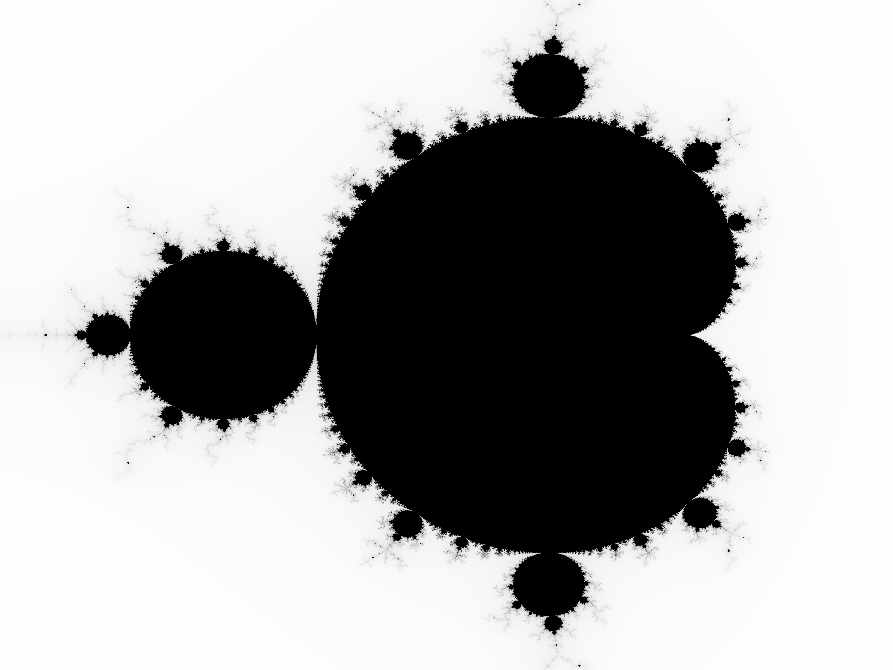

# Mandelbrot Generator
This is a sample rust program created by following the tutorial in the O'Reilly Programming Rust book.

Created with the following command: `mandelbrot example.png 4000x3000 -1.60,1 0.8,-1`

## Compilation
Run `cargo build --release`

## Testing
Run `cargo test`

## Running
Usage: `mandelbrot FILE PIXELS UPPERLEFT LOWERRIGHT` 